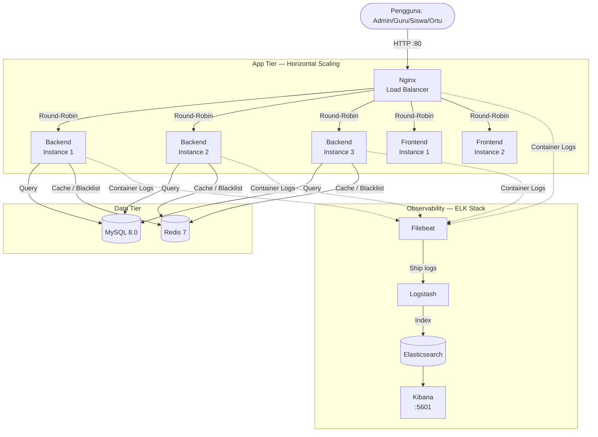
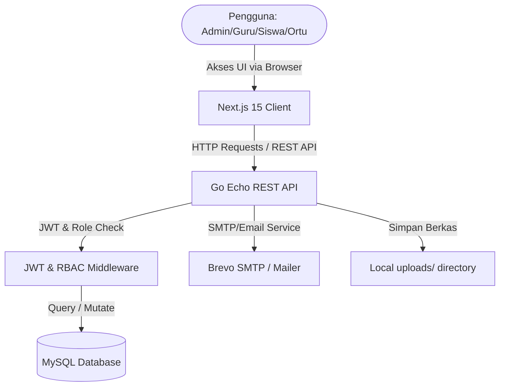

# 📚 Jurnal & Attendance Management System (JAMS)

[](https://golang.org)
[](https://nextjs.org)
[](https://mysql.com)
[](https://redis.io)
[](https://nginx.org)
[](https://elastic.co)
[](https://docker.com)

**Jurnal & Attendance Management System (JAMS)** adalah platform sistem informasi manajemen sekolah terintegrasi berbasis web. Aplikasi ini dirancang untuk mendigitalisasi pencatatan jurnal mengajar guru, absensi kehadiran siswa & guru berbasis QR Code/GPS, perizinan, bimbingan konseling (BK), hingga pengolahan laporan akademik secara real-time.

---

## 🏗️ Arsitektur Sistem



---

## 🛠️ Teknologi & Stack

| Layer | Teknologi | Keterangan |
|---|---|---|
| **Backend** | Go 1.21 + Echo v4 | REST API modular, RBAC, JWT |
| **Frontend** | Next.js 15 + TypeScript | App Router, standalone Docker output |
| **Database** | MySQL 8.0 + GORM | ORM dengan AutoMigrate & Seeder |
| **Cache / Session** | Redis 7 | Token blacklist (logout), dashboard cache |
| **Load Balancer** | Nginx 1.25 | Reverse proxy, rate limiting, JSON logging |
| **Monitoring** | Elasticsearch 8.14 | Full-text log search & analytics |
| **Log Pipeline** | Logstash 8.14 + Filebeat 8.14 | Kumpulkan → proses → kirim ke ES |
| **Visualisasi** | Kibana 8.14 | Dashboard monitoring & alerting |
| **Styling** | Tailwind CSS + Shadcn/UI | Desain modern, dark/light mode |
| **Auth** | JWT Access (2 jam) + Refresh (7 hari) | Stateless, revokasi via Redis |
| **Container** | Docker + Docker Compose | Orchestration + Swarm untuk produksi |

---

## 📁 Struktur Folder Proyek

```
manajemenjurnal-app/
├── docker-compose.yml          # Stack lengkap (dev/staging)
├── docker-compose.prod.yml     # Override produksi: replicas + resource limits
├── .env.example                # Template variabel environment (root)
│
├── backend/                    # Go/Echo REST API (port 8080 internal)
│   ├── Dockerfile              # Multi-stage build → alpine runtime
│   ├── cmd/api/main.go         # Entrypoint: init DB, Redis, Echo
│   ├── config/config.go        # Baca semua env vars termasuk Redis
│   ├── internal/
│   │   ├── domain/             # Entity struct & Repository interface
│   │   ├── dto/                # Request/Response DTO
│   │   ├── handler/            # HTTP Handler (termasuk Logout + Dashboard cache)
│   │   ├── middleware/         # JWT (+ Redis blacklist check) & RBAC
│   │   ├── repository/         # GORM query implementation
│   │   └── service/            # Business logic
│   ├── pkg/
│   │   └── database/
│   │       ├── db.go           # MySQL init + AutoMigrate
│   │       ├── redis.go        # Redis init, BlacklistToken, cacheGet/Set
│   │       └── seed.go         # Data seeder awal
│   └── routes/routes.go        # API routing dengan rdb injected
│
├── frontend/                   # Next.js 15 (port 3000 internal)
│   ├── Dockerfile              # Multi-stage: deps → build → standalone runner
│   ├── next.config.ts          # output: "standalone" untuk Docker
│   └── src/
│       ├── app/                # App Router (dashboard, login, dll)
│       ├── components/ui/      # Shadcn/UI komponen
│       ├── lib/api.ts          # Axios client → /api (melalui Nginx)
│       ├── providers/          # React Query + Theme provider
│       └── stores/auth.ts      # Zustand auth store
│
├── nginx/
│   └── nginx.conf              # Upstream pool, rate limit, JSON access log
│
└── elk/
    ├── elasticsearch/elasticsearch.yml
    ├── logstash/
    │   ├── logstash.yml
    │   └── pipeline/logstash.conf   # Parse log Go/Nginx/MySQL → Elasticsearch
    ├── kibana/kibana.yml
    └── filebeat/filebeat.yml         # Collect Docker container logs
```

---

## ✨ Fitur Utama

### 1. 📖 Jurnal Mengajar & Presensi
- Pencatatan jurnal harian guru per pertemuan & mapel
- Presensi siswa (Hadir/Sakit/Izin/Alpa) per kelas
- Request mundur jurnal dengan approval admin

### 2. 📷 Absensi QR & GPS
- QR Code unik per siswa dan guru
- Scan gerbang: deteksi otomatis **Masuk** / **Pulang** berdasarkan `jam_pulang_mulai`
- Waktu scan (`waktu_scan`) dan tipe absen (`masuk`/`pulang`) tersimpan di DB
- Self check-in guru via GPS Geofencing

### 3. 📋 Perizinan Siswa & Guru

### 4. 🧠 Bimbingan Konseling, Pelanggaran & Prestasi

### 5. 📊 Dashboard Analitik Real-time
- Admin: 8 stat cards + bar chart + pie chart
- Guru/Wali Kelas: status check-in, jurnal bulan ini, kehadiran rate
- Orang Tua: ringkasan per anak (kehadiran, pelanggaran, izin pending)
- **Semua dashboard di-cache Redis 5 menit** untuk performa optimal

### 6. 🔐 Keamanan Auth
- Logout aktif merevokasi token via Redis blacklist
- Setiap request JWT dicek ke Redis sebelum divalidasi

---

## 🚀 Panduan Instalasi

### A. Development Lokal (tanpa Docker)

**Prasyarat:** Go 1.21+, Node.js 20+, MySQL 8.0, Redis 7

#### 1. Clone & Setup Environment

```bash
git clone https://github.com/Aksan14/jurnal-management-app.git
cd jurnal-management-app

# Salin template env ke root project
cp .env.example .env
```

Edit `.env` dan sesuaikan:

```env
# Database
DB_HOST=127.0.0.1
DB_PORT=3306
DB_USER=root
DB_PASSWORD=your_mysql_password
DB_NAME=jurnal_db

# Redis (kosongkan jika tidak pakai Redis lokal)
REDIS_ADDR=127.0.0.1:6379
REDIS_PASSWORD=
REDIS_DB=0

# JWT
JWT_SECRET=ganti_dengan_string_acak_minimal_32_karakter
JWT_REFRESH_SECRET=ganti_dengan_string_acak_lain_minimal_32_karakter

# SMTP (opsional)
SMTP_HOST=smtp.gmail.com
SMTP_PORT=587
SMTP_USER=your-email@gmail.com
SMTP_PASS=your-app-password
```

#### 2. Jalankan Backend

```bash
cd backend
go mod tidy
go run cmd/api/main.go
# Backend berjalan di http://localhost:8080
```

> Database `jurnal_db` dibuat otomatis dan di-seed dengan akun default bila tabel masih kosong.

#### 3. Jalankan Frontend

```bash
cd frontend
npm install
npm run dev
# Frontend berjalan di http://localhost:3000
```

> Pastikan `NEXT_PUBLIC_API_URL` di `.env` frontend mengarah ke `http://localhost:8080/api` saat dev lokal.

---

### B. Docker Compose — Semua Service Sekaligus (Direkomendasikan)

**Prasyarat:** Docker Engine 24+ dan Docker Compose v2

```bash
git clone https://github.com/Aksan14/jurnal-management-app.git
cd jurnal-management-app

# 1. Salin dan isi environment variable
cp .env.example .env
# Edit .env — minimal isi DB_PASSWORD, REDIS_PASSWORD, JWT_SECRET, JWT_REFRESH_SECRET

# 2. Build image dan jalankan semua service
docker compose up -d --build

# 3. Cek status semua container
docker compose ps
```

Service yang berjalan:

| Service | Port Publik | Keterangan |
|---|---|---|
| Nginx | `80` | Entry point semua traffic |
| Backend | — (internal) | Go API, di-proxy Nginx via `/api/` |
| Frontend | — (internal) | Next.js, di-proxy Nginx via `/` |
| MySQL | `3306` | Database utama |
| Redis | `6379` | Cache & token blacklist |
| Elasticsearch | `9200` | Log storage |
| Kibana | `5601` | Monitoring dashboard |
| Logstash | `5044`, `9600` | Log pipeline |

Buka **`http://localhost`** untuk mengakses aplikasi.  
Buka **`http://localhost:5601`** untuk Kibana monitoring.

---

### C. Production — Horizontal & Vertical Scaling

#### Opsi 1: Docker Compose dengan `--scale`

```bash
# Scale backend ke 3 instance, frontend ke 2 instance
docker compose -f docker-compose.yml -f docker-compose.prod.yml \
  up -d --scale backend=3 --scale frontend=2
```

#### Opsi 2: Docker Swarm (Direkomendasikan untuk Produksi)

```bash
# Inisialisasi Swarm pada server manager
docker swarm init

# Deploy stack dengan konfigurasi produksi
docker stack deploy \
  -c docker-compose.yml \
  -c docker-compose.prod.yml \
  jurnal
```

`docker-compose.prod.yml` mendefinisikan:

| Service | Replicas | CPU Limit | RAM Limit |
|---|---|---|---|
| backend | **3** | 1.0 core/inst | 512 MB/inst |
| frontend | **2** | 0.75 core | 512 MB |
| mysql | 1 | 2.0 core | 2 GB |
| redis | 1 | 0.5 core | 512 MB |
| elasticsearch | 1 | 2.0 core | 3 GB |

---

## 🔑 Akun Default (Seed Data)

Password default: **`Admin123!`**

| Username | Role | Akses |
|---|---|---|
| `admin` | `admin` | Full access: master data, scan absensi, laporan |

> **Penting:** Segera ganti password default setelah login pertama.

---

## 📡 API Endpoints Penting

Semua request melalui Nginx: `http://localhost/api/...`

| Method | Endpoint | Auth | Keterangan |
|---|---|---|---|
| `POST` | `/api/auth/login` | — | Login, dapat access + refresh token |
| `POST` | `/api/auth/logout` | JWT | **Revoke token via Redis blacklist** |
| `POST` | `/api/auth/refresh` | — | Perbarui access token |
| `GET` | `/api/reports/dashboard` | JWT | Dashboard admin/guru/siswa (Redis cache) |
| `GET` | `/api/reports/dashboard/guru` | JWT | Dashboard khusus guru (Redis cache) |
| `GET` | `/api/reports/dashboard/ortu` | JWT | Dashboard orang tua (Redis cache) |
| `POST` | `/api/attendance/scan/student` | JWT | Scan QR siswa → deteksi masuk/pulang |
| `POST` | `/api/attendance/scan/teacher` | JWT | Scan QR guru |

---

## 🔒 Keamanan Production

1. **Ganti semua secret di `.env`** — `JWT_SECRET`, `JWT_REFRESH_SECRET`, `DB_PASSWORD`, `REDIS_PASSWORD` wajib diganti dengan string acak yang kuat.
2. **Aktifkan HTTPS** — Pasang SSL certificate di Nginx (Let's Encrypt / Certbot).
3. **Sembunyikan port internal** — Jangan expose `3306`, `6379`, `9200` ke publik. Gunakan firewall (ufw/iptables).
4. **Aktifkan Elasticsearch Security** — Untuk produksi, set `xpack.security.enabled=true` di `elk/elasticsearch/elasticsearch.yml` dan buat password ES.
5. **Rotasi JWT Secret** — Jika secret bocor, ganti di `.env` dan restart backend. Semua sesi aktif otomatis tidak valid.

---

## 📊 Monitoring dengan Kibana

Setelah stack berjalan, akses **`http://localhost:5601`** dan:

1. Buka **Discover** → pilih index pattern `jurnal-logs-*`
2. Filter log per service: `container.name: backend` / `container.name: nginx`
3. Buat **Dashboard** untuk memantau:
   - Request rate & response time (dari Nginx access log)
   - Error rate backend (level: `error`)
   - Query lambat MySQL

---

## 📝 Lisensi
Proyek ini dilisensikan di bawah lisensi internal institusi sekolah. Seluruh hak cipta dilindungi undang-undang © 2026.


**Jurnal & Attendance Management System (JAMS)** adalah platform sistem informasi manajemen sekolah terintegrasi berbasis web. Aplikasi ini dirancang untuk mendigitalisasi pencatatan jurnal mengajar guru, absensi kehadiran siswa & guru berbasis QR Code/GPS, perizinan, bimbingan konseling (BK), hingga pengolahan laporan akademik secara real-time.

---

## 🏗️ Arsitektur Sistem & Aliran Data

Berikut adalah visualisasi bagaimana pengguna berinteraksi dengan frontend Next.js, berkomunikasi dengan Backend API Go Echo (terlindungi oleh JWT & RBAC), serta berinteraksi dengan database MySQL:



---

## 🛠️ Teknologi & Stack Modern

| Layer | Teknologi / Library | Keterangan |
|---|---|---|
| **Backend** | Go (Golang) + Echo Framework | REST API berkinerja tinggi, bersih, dan modular |
| **Frontend** | Next.js 15 + TypeScript | Client-side dashboard interaktif & cepat |
| **Database** | MySQL 8.0 | Penyimpanan relasional terstruktur |
| **ORM** | GORM | Pemetaan database ke struct Go secara efisien |
| **Styling** | Tailwind CSS + Shadcn/UI | Antarmuka premium dengan desain modern & responsif |
| **Auth** | JWT (Access & Refresh Token) | Keamanan endpoint dan autentikasi stateless |
| **Notification**| Brevo SMTP | Pengiriman notifikasi / reset password melalui email |
| **State Management** | Zustand & React Query | Pengelolaan state client dan caching data server |

---

## 📁 Struktur Folder Proyek

```
manajemenjurnal-app/
├── backend/              # Go/Echo REST API (Port 8080)
│   ├── cmd/api/          # Entrypoint aplikasi (main.go)
│   ├── config/           # Konfigurasi aplikasi & database
│   ├── internal/
│   │   ├── domain/       # Struct Entity & Interface Repository
│   │   ├── dto/          # Data Transfer Object (Request/Response)
│   │   ├── handler/      # HTTP Router Controller / Handler
│   │   ├── middleware/   # JWT Authentication & RBAC Check
│   │   ├── repository/   # Query Database GORM
│   │   └── service/      # Business Logic aplikasi
│   ├── pkg/
│   │   └── database/     # Inisialisasi DB & Seeder
│   └── routes/           # Routing API Grouping
└── frontend/             # Next.js Application (Port 3000)
    ├── public/           # File statik & aset
    └── src/
        ├── app/          # App Router Next.js (Dashboard & Auth)
        ├── components/   # Komponen UI Reusable (Shadcn/UI)
        ├── lib/          # Konfigurasi Axios API Client & Helper
        ├── providers/    # Context & Query Providers
        └── stores/       # Global State Management (Zustand)
```

---

## ✨ Fitur Utama & Fungsionalitas

### 1. 📖 Jurnal Mengajar & Presensi
- **Pencatatan Pertemuan**: Guru mencatat jurnal mengajar harian lengkap dengan bahasan materi.
- **Presensi Kelas**: Input status kehadiran siswa (Hadir, Sakit, Izin, Alpa) per pertemuan mapel.
- **Request Mundur Jurnal**: Pengajuan izin pengisian jurnal yang terlewat pada hari sebelumnya dengan approval otomatis/manual oleh Admin.

### 2. 📷 Absensi QR & GPS (Siswa & Guru)
- **Kartu QR Dinamis**: QR Code unik untuk siswa dan guru (`JURNAL_QR:siswa:{id}` / `JURNAL_QR:guru:{id}`).
- **Scan Gerbang Sekolah**: Petugas/Admin memindai QR Code siswa di pintu gerbang untuk mencatat jam masuk/pulang.
- **Self Check-in Guru**: Guru dapat melakukan absensi mandiri melalui aplikasi dengan pembatasan berbasis lokasi GPS (Geofencing) dan deteksi jam terlambat.

### 3. 📋 Pengajuan Perizinan (Siswa & Guru)
- **Izin Siswa**: Orang tua atau siswa mengajukan izin tidak hadir disertai bukti dokumen/foto.
- **Izin Mengajar Guru**: Guru mengajukan perizinan tidak mengajar dengan disposisi otomatis ke wali kelas atau kepsek.
- **Status Notifikasi**: Notifikasi persetujuan izin secara real-time.

### 4. 🧠 Bimbingan Konseling (BK) & Dashboard Siswa
- **Sesi Konseling**: Guru BK dapat mengelola catatan rahasia sesi konseling siswa.
- **Poin Pelanggaran & Prestasi**: Input poin pelanggaran tata tertib dan riwayat prestasi akademik/non-akademik siswa.
- **Tes Psikologi**: Pengunggahan berkas/hasil tes psikologi siswa untuk referensi konseling.

### 5. 📊 Dashboard Analitik & Laporan
- **Visualisasi Grafik**: Statistik kehadiran, jumlah pelanggaran, dan jurnal terisi per kelas.
- **Ekspor Laporan**: Unduh ringkasan jurnal mengajar, absensi bulanan, dan log aktivitas sistem.

---

## 🚀 Panduan Instalasi & Cara Menjalankan

### Prasyarat System
Sebelum memulai, pastikan perangkat Anda telah terinstall:
- **Go** (versi 1.21 atau lebih tinggi)
- **Node.js** (versi 18 atau lebih tinggi)
- **MySQL** (versi 8.0 atau lebih tinggi)

---

### Langkah 1: Clone Repository
```bash
git clone https://github.com/Aksan14/jurnal-management-app.git
cd jurnal-management-app
```

### Langkah 2: Setup Database & Backend
1. Masuk ke direktori backend:
   ```bash
   cd backend
   ```
2. Buat file `.env` dari template:
   ```bash
   cp .env.example .env
   ```
3. Sesuaikan konfigurasi database MySQL & SMTP Brevo pada file `.env` yang baru dibuat:
   ```env
   PORT=8080
   DB_HOST=127.0.0.1
   DB_PORT=3306
   DB_USER=root
   DB_PASSWORD=your_mysql_password
   DB_NAME=jurnal_db
   
   JWT_SECRET=gunakan_string_acak_panjang_disini
   JWT_REFRESH_SECRET=gunakan_string_acak_panjang_kedua_disini
   ```
4. Download dependencies dan jalankan backend:
   ```bash
   go mod tidy
   go run cmd/api/main.go
   ```
   > **Note**: Database `jurnal_db` akan dibuat secara otomatis dan di-seed dengan data awal (akun default) jika tabel kosong.

---

### Langkah 3: Setup Frontend
1. Buka terminal baru dan masuk ke direktori frontend:
   ```bash
   cd frontend
   ```
2. Salin template environment variable:
   ```bash
   cp .env.local.example .env.local  # atau edit langsung berkas .env.local yang ada
   ```
3. Pastikan `.env.local` merujuk pada port backend yang benar:
   ```env
   NEXT_PUBLIC_API_URL=http://localhost:8080/api
   NEXT_PUBLIC_BACKEND_URL=http://localhost:8080
   ```
4. Install package dan jalankan development server:
   ```bash
   npm install
   npm run dev
   ```
5. Buka `http://localhost:3000` pada browser Anda.

---

### Langkah 4: Menjalankan Menggunakan Docker
Jika Anda ingin menjalankan aplikasi secara cepat dalam container:
```bash
# Jalankan backend Docker
cd backend
docker build -t jurnal-backend .
docker run -d -p 8080:8080 --env-file .env jurnal-backend
```

---

## 🔑 Akun Default (Seed Data)

Akun default berikut menggunakan password: **`Password123!`**

| Username | Role | Deskripsi Akses |
|---|---|---|
| `admin` | `admin` | Pengelolaan data master, jam kerja, absensi scan, reset pass. |

> [!WARNING]
> Sangat disarankan untuk segera mengubah password default akun `admin` di atas pada halaman profil setelah Anda pertama kali login demi alasan keamanan data.

---

## 🔒 Panduan Deploy & Keamanan Production

1. **Gunakan String JWT Unik**: Pastikan `JWT_SECRET` dan `JWT_REFRESH_SECRET` diubah dengan karakter acak yang panjang di environment server.
2. **Aktifkan HTTPS**: Gunakan SSL melalui Nginx/Caddy Reverse Proxy untuk enkripsi data token JWT selama transmisi.
3. **Database Security**: Selalu sembunyikan port database (`3306`) dari akses publik dan izinkan koneksi hanya dari host lokal backend.
4. **Valid SMTP**: Masukkan SMTP credentials valid untuk memastikan notifikasi email & reset sandi berjalan tanpa kendala.

---

## 📝 Lisensi
Proyek ini dilisensikan di bawah lisensi internal institusi sekolah. Seluruh hak cipta dilindungi undang-undang © 2026.
